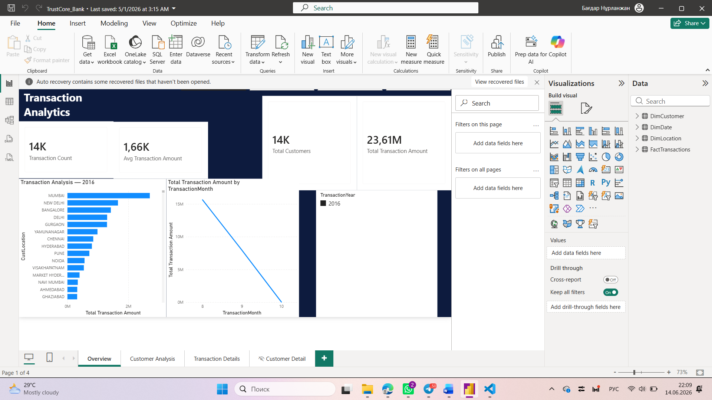
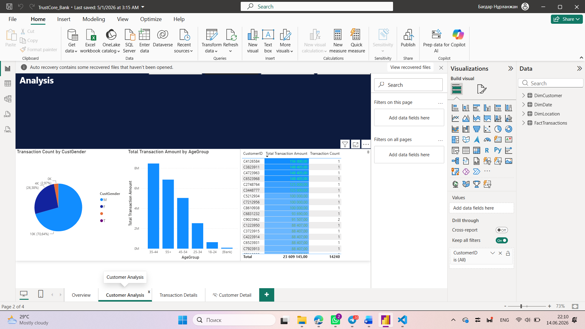
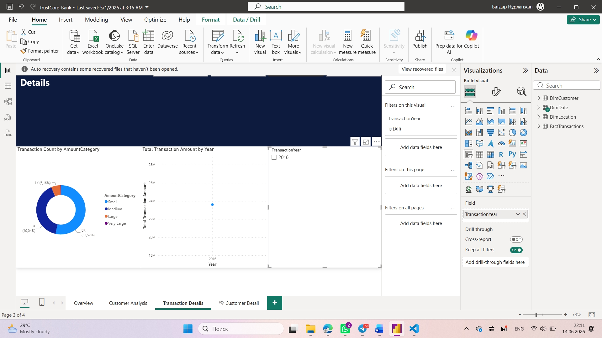

# TrustCore Bank — Transaction Analytics Dashboard
> Power BI project analyzing 1M+ bank transactions across India

## Overview
An interactive multi-page Power BI report built for TrustCore Bank, a fictional retail bank serving 800,000+ customers across major Indian cities. The report transforms raw transactional data into actionable business insights for management, branch managers, and data analysts.

## Dashboard Preview
## Screenshots

### Overview


### Customer Analysis


### Transaction Details


## Business Questions Answered
- Which cities generate the highest transaction volumes?
- Which customer age groups are most financially active?
- How are transactions distributed across amount categories (Small / Medium / Large)?
- How do transaction trends change month over month?
- Who are the top customers by transaction value?

## Dataset
- **Source:** [Bank Customer Segmentation — Kaggle](https://www.kaggle.com/datasets/shivamb/bank-customer-segmentation)
- **Size:** 1M+ transactions, 14,240 records after filtering
- **Coverage:** Mumbai, Delhi, Bangalore, Chennai, Hyderabad, Pune and 590+ cities

| Column | Description |
|--------|-------------|
| TransactionID | Unique transaction identifier |
| CustomerID | Unique customer identifier |
| CustomerDOB | Customer date of birth |
| CustGender | Customer gender (M/F) |
| CustLocation | City of the transaction |
| CustAccountBalance | Account balance at time of transaction (INR) |
| TransactionDate | Date of the transaction |
| TransactionAmount (INR) | Transaction amount in Indian Rupees |

## Data Model (Star Schema)
```
FactTransactions ──► DimCustomer   (Many-to-One)
FactTransactions ──► DimLocation   (Many-to-One)
FactTransactions ──► DimDate       (Many-to-One)
```

## Power Query Transformations
- Type conversions for date and decimal columns
- Custom calculated columns: `Age`, `AgeGroup` (18-24, 25-34, 35-44, 45-54, 55+)
- Custom calculated column: `AmountCategory` (Small <500 / Medium <5K / Large <50K / Very Large 50K+)
- Error removal from balance and amount columns

## DAX Measures
| Measure | Formula |
|---------|---------|
| Total Transaction Amount | `SUM(FactTransactions[TransactionAmount (INR)])` |
| Total Customers | `DISTINCTCOUNT(FactTransactions[CustomerID])` |
| Avg Transaction Amount | `AVERAGE(FactTransactions[TransactionAmount (INR)])` |
| Total Account Balance | `SUM(FactTransactions[CustAccountBalance])` |
| Transaction Count | `COUNTROWS(FactTransactions)` |
| Dynamic Title | `"Transaction Analysis — " & SELECTEDVALUE(DimDate[TransactionYear], "All Years")` |

## Report Pages
| Page | Description |
|------|-------------|
| Overview | KPI cards (14K transactions, 23.61M INR total, 1.66K INR avg), bar chart by city, monthly trend line |
| Customer Analysis | Gender split (Male 70.6% / Female 26.4%), age group column chart, top customer table with conditional formatting |
| Transaction Details | Amount category donut chart, yearly trend, year slicer |
| Customer Detail | Hidden drillthrough page — individual transaction history per customer |

## Key Features
- **Drillthrough navigation** — right-click any customer to see their full transaction history
- **Conditional formatting** — color gradient on customer table highlights top spenders
- **Dynamic chart titles** — update automatically based on selected year filter
- **Page navigator buttons** — consistent navigation across all pages
- **Bookmarks** — saved report states for quick access to key views
- **Published to Power BI Service** — [View Live Report](https://app.powerbi.com/groups/me/reports/8a230919-5d59-4ccf-9b07-afa7aadb3710/c4c4733a19646bd6a570)

## Tools Used
- Power BI Desktop
- Power Query (M language)
- DAX
- Power BI Service

## Key Insights
- **Mumbai** is the top city by total transaction amount
- **35–44 age group** is the most financially active customer segment
- **53.6%** of transactions fall in the Large category (5K–50K INR)
- Transaction volumes peak in specific months — visible in the monthly trend line
